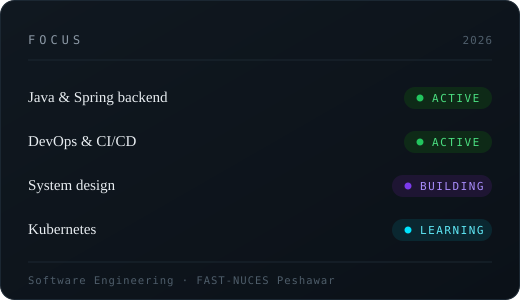

<!-- ────────────────────────────  HERO  ──────────────────────────── -->

<a href="https://personalportfolio-zeta-sooty.vercel.app/">
  
</a>

<br>

> I don't just write code. I build systems &mdash; the services, queues and pipelines
> that keep everything else running under load.

<br>

<!-- ────────────────────────────  STATUS + FOCUS  ──────────────────────────── -->

<table>
<tr>
<td width="52%" valign="top">



</td>
<td width="48%" valign="top">

#### `CURRENTLY BUILDING`

```text
→  Production-grade Java + Spring Boot backends
→  Event-driven services with an outbox + ledger
→  Docker images and GitHub Actions pipelines
→  Kubernetes fundamentals
→  System & distributed-systems design
→  Open-source contributions (JabRef)
```

<sub>Software Engineering @ **FAST-NUCES Peshawar** · heading toward
Java Backend + DevOps. Systems thinking, DSA, and a standing
curiosity about security and distributed systems.</sub>

</td>
</tr>
</table>

<br>

<!-- ────────────────────────────  TECH STACK  ──────────────────────────── -->

### `TECH STACK`

Organised the way I reason about a system &mdash; not as a logo wall.

| Layer | Tools |
| :--- | :--- |
| **Languages** | Java · C++ · Python · SQL · Bash |
| **Backend** | Spring Boot · Spring Security · REST APIs · Servlets / JDBC · Tomcat |
| **Data & messaging** | PostgreSQL · MySQL · Apache Kafka · Redis |
| **Infrastructure** | Docker · GitHub Actions · Linux · Nginx · AWS |
| **Learning next** | Kubernetes · Terraform · Prometheus / Grafana |

<sub>Bold layers are where I work day to day. *Learning next* is honest &mdash; I'm not
going to claim a tool I'm still reading the docs for.</sub>

<br>

<!-- ────────────────────────────  JOURNEY  ──────────────────────────── -->

### `ENGINEERING JOURNEY`

```text
   programming
        │
   data structures & algorithms  ──►  dsa-cpp
        │
   Java  ──►  Spring Boot
        │
   backend engineering  ──►  APIs · persistence · auth
        │
   distributed systems  ──►  events · outbox · idempotency
        │
   devops  ──►  Docker · CI/CD
        │
   cloud & infrastructure        ● in progress
```

<br>

<!-- ────────────────────────────  FLAGSHIP  ──────────────────────────── -->

### `FEATURED PROJECT`

<table>
<tr><td valign="top">

## &nbsp;ASCEND &nbsp;<sub>`● BUILDING`</sub>

**An auditable XP ledger for real-world effort.** Real work &mdash; studying, building,
training, reflection &mdash; is logged as events. The server evaluates each event against
*versioned* rules and writes an **append-only ledger**; character and progress are
disposable projections rebuilt from that ledger.

The engineering interest isn't the theme &mdash; it's the guarantees:

- **XP can never come from the client.** The request has no XP field; unknown JSON is rejected.
- **Append-only for real** &mdash; enforced by DB triggers *and* a runtime role with only `SELECT, INSERT`.
- **Exactly-once effect** &mdash; outbox pattern + unique constraints + idempotency keys, no broker.
- **Deterministic evaluation** &mdash; the rules engine is a pure function of `(event, rule versions, context)`; it never reads the clock.

`Java 21` · `Spring Boot 3.5` · `Spring Modulith` · `PostgreSQL` · `React + TS` · `Docker` · `CI`

**Architecture → Security → Exactly-once processing → Deploy**

[&nbsp;**VIEW PROJECT →**&nbsp;](https://github.com/moodi-mrt/ascend)

</td></tr>
</table>

<br>

<!-- ────────────────────────────  SELECTED WORK  ──────────────────────────── -->

### `SELECTED WORK`

| Project | What it solves | Stack | Status |
| :--- | :--- | :--- | :---: |
| **[ascend](https://github.com/moodi-mrt/ascend)** | Append-only XP ledger with versioned rules & deterministic evaluation | Java · Spring · Postgres | `BUILDING` |
| **[nascon-webscan](https://github.com/moodi-mrt/nascon-webscan)** | Authorized-use web-scan orchestrator for CTF challenges → one clean bug report | Python | `COMPLETED` |
| **[nocap OS](https://personalportfolio-zeta-sooty.vercel.app/)** | Portfolio as an interactive terminal | React · Vite | `LIVE` |
| **[dsa-cpp](https://github.com/moodi-mrt/dsa-cpp)** | DSA practice: arrays, two-pointers, sliding window | C++ | `ONGOING` |

<br>

<!-- ────────────────────────────  LEARNING SYSTEM  ──────────────────────────── -->

### `LEARNING SYSTEM`

| `NOW` | `NEXT` | `LATER` |
| :--- | :--- | :--- |
| Kubernetes | Terraform | Cloud architecture |
| Spring Security | Advanced Kubernetes | High-scale backends |
| System design | Distributed systems | Observability at depth |

<br>

<!-- ────────────────────────────  BEYOND  ──────────────────────────── -->

### `BEYOND SOFTWARE`

I follow **financial markets** seriously &mdash; less for the charts, more for the
*systems* thinking they demand: market structure, macro, risk management and
decisions under uncertainty. It's the same discipline as good engineering &mdash;
model the system, define the failure mode, size the risk.

<br>

<!-- ────────────────────────────  PHILOSOPHY  ──────────────────────────── -->

> **Build systems that stay understandable once they get complex.**
> Correctness first, then make it operable, then make it fast.

<br>

<!-- ────────────────────────────  CONTACT  ──────────────────────────── -->

### `LET'S BUILD`

**[Portfolio](https://personalportfolio-zeta-sooty.vercel.app/)** &nbsp;·&nbsp;
**[LinkedIn](https://www.linkedin.com/in/muhammad-mehmood-21b635431)** &nbsp;·&nbsp;
**[GitHub](https://github.com/moodi-mrt)** &nbsp;·&nbsp;
**[Email](mailto:mehmoodkhanmrt@gmail.com)**

<sub>Open to backend / DevOps internships and open-source collaboration.</sub>
